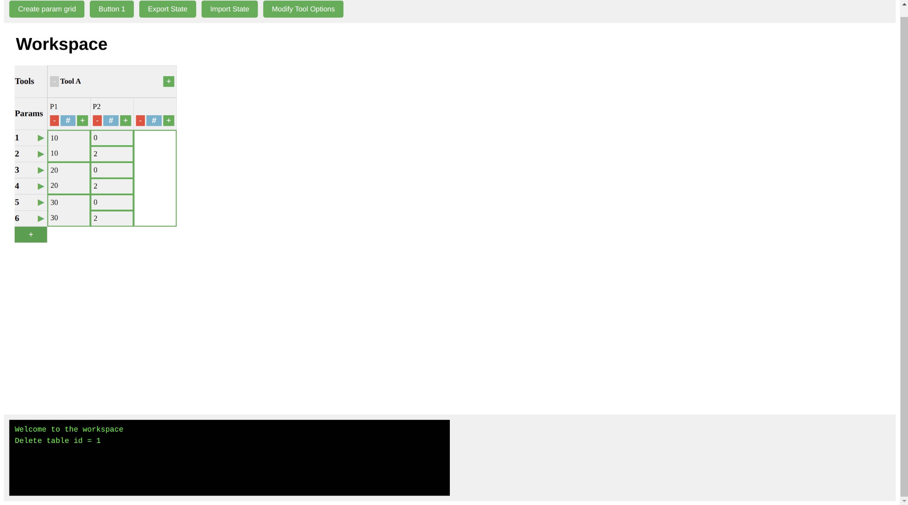
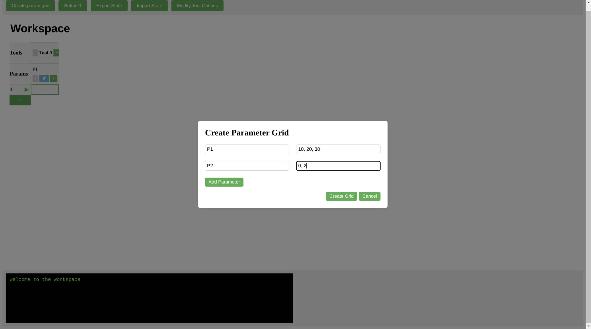
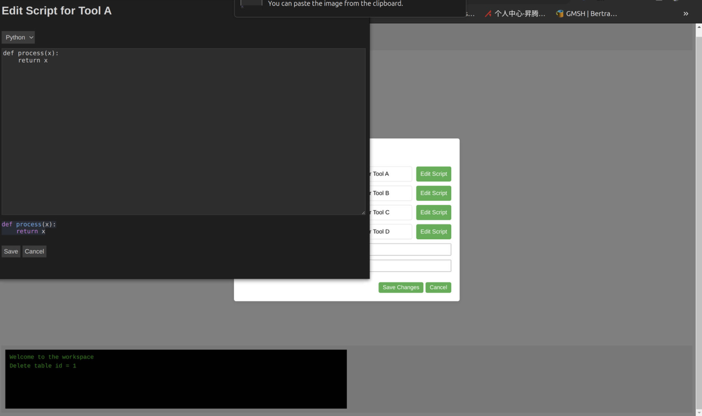
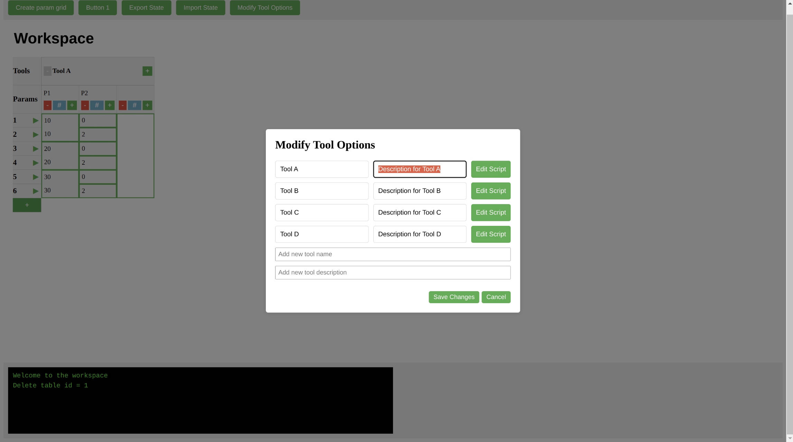

The Workbench Project
===

## Author
Yunlong Lian

## Introduction

This project is a work in progress. The purpose is to create a web application front-end to manage a simulation project. The basic idea and functionality follows the Sentaurus Workbench, but the architecture is different in significant ways.

The Workbench Project is intended to be a more general purpose, cloud native simulation project management tool. Here are the main goals for the web application front-end:

+ maintain the flow of simulation stages

+ maintain the table of parameter configurations in each stage

+ display the status of the simulations

+ import and export the simulation configuration data

+ communicate with the simulation server

## Current Status (screenshots)

## Feature wishlist

- [ ] Core data structure
  - [ ] Status table
  - [ ] Tool flow
  - [ ] Tree of parameters

- [ ] Tool dependency
  - [ ] DAG modelling
  - [ ] Parallel execution of simulation tasks

- [ ] Logging
  - [ ] Display log for every action from user in system message window
  - [ ] Exporting log
  - [ ] Workspace reconstruction from log

- [ ] Control
  - [ ] Log as script
  - [ ] Strategy for task execution priority

- [ ] UI component style
  - [ ] Consistency
  - [ ] Intelligence

- [ ] Code editor and execution
  - [ ] Integrate [monaco-editor](https://github.com/react-monaco-editor/react-monaco-editor) or [codejar](https://github.com/antonmedv/codejar)
  - [ ] Compose and execute tool entirely within front-end
  - [ ] UI as a calculator for immediate verification

## Demands are welcome

If you have any idea or specific demand, please let me know by opening an issue. 

Urgent demands are prioritized only after you become a patron of the project, or fuck the repo on your own. 
Contact me at yunlong.lian@proton.me for details.

